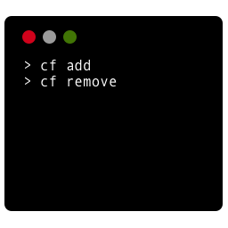

<h1 align="center">
  <br>
	
  <br>
  <br>
  <br>
</h1>

<p align="center">
<pre>
  ██████╗██╗     ██╗    ███████╗ █████╗  ██████╗████████╗ ██████╗ ██████╗ ██╗   ██╗
  ██╔════╝██║     ██║    ██╔════╝██╔══██╗██╔════╝╚══██╔══╝██╔═══██╗██╔══██╗╚██╗ ██╔╝
  ██║     ██║     ██║    █████╗  ███████║██║        ██║   ██║   ██║██████╔╝ ╚████╔╝ 
  ██║     ██║     ██║    ██╔══╝  ██╔══██║██║        ██║   ██║   ██║██╔══██╗  ╚██╔╝  
  ╚██████╗███████╗██║    ██║     ██║  ██║╚██████╗   ██║   ╚██████╔╝██║  ██║   ██║   
   ╚═════╝╚══════╝╚═╝    ╚═╝     ╚═╝  ╚═╝ ╚═════╝   ╚═╝    ╚═════╝ ╚═╝  ╚═╝   ╚═╝
</pre>
</p>

# About

✨ a guided and prescriptive CLI creator.

# Quick Start

```
$ npm install -g cf
```

# Advanced Usage

**hooks list**

* will-inject: before command module's injection
* will-parse: before cli-engine start

```javascript
bootstrap.hooks.listen('will-inject', async (next) => {
  try {
    await sleep(3000)
  } catch (error) {
    console.log(error)
  }
  
  await next();
})
```

# Feature

> TODO
